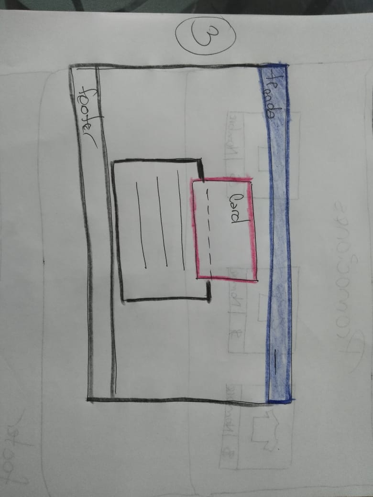
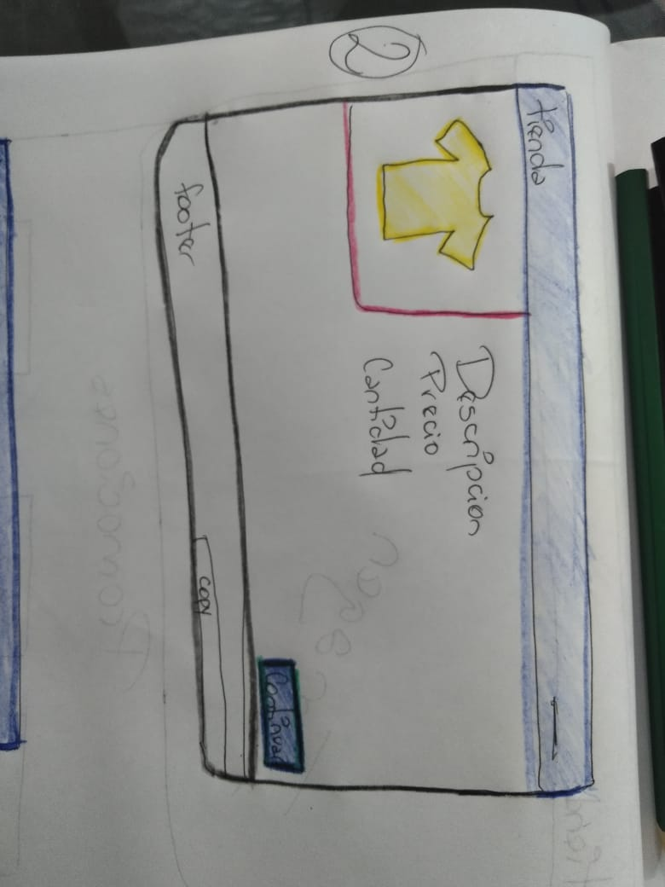
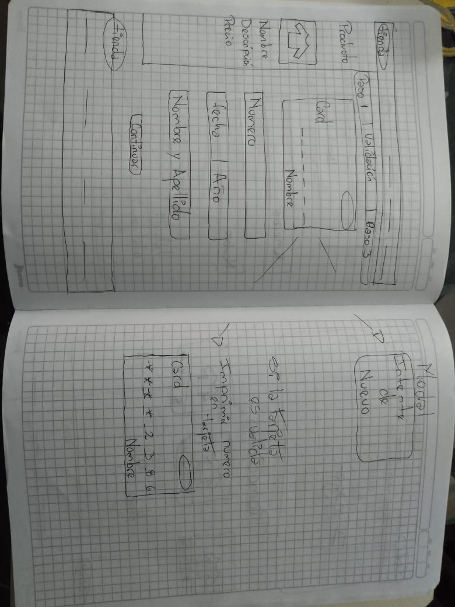
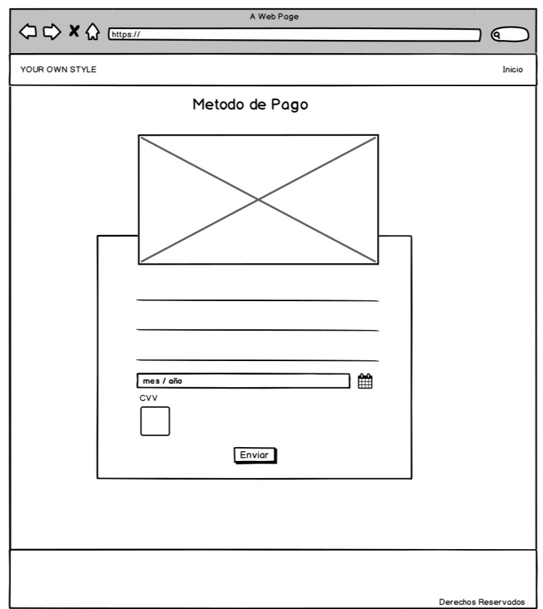
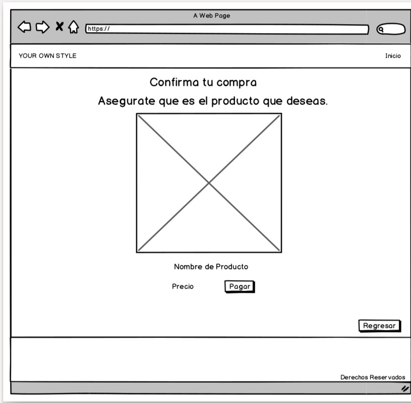
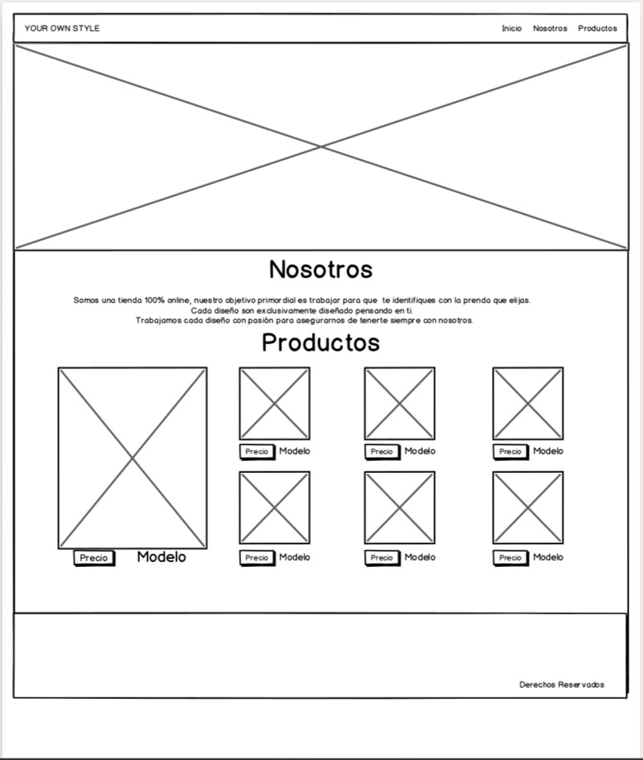

# Tarjeta de crédito válida

## DEFINICION
Tienda de chaquetas online

YOUR OWN STYLE
Nosotros diseñamos la pagina web pensando en la comodida de las mujeres para que puedan comprar sin tener que salir de casa, le aseguramos una compra segura al poder escoger el metodo de pago de su preferencia.

## INVESTIGACION UX
Los principales usuarios son mujeres.
El poder comprar desde la comodida de casa.
Tener la seguridad de resivir el producto en el lugar donde este.
## PROTOTIPO EN LAPIZ

## Feedback
Mejoras en la parte de la validacion de la tarjeta cuando el usuario no digitara el numero de tarjeta, saliera una ventana indicandole que deberia dijitar un numero  detarjeta para continuar, tener la posibilidad de confirmar primero su compra si no estaba seguro poder mirar otra opcion de producto.

## PROTOTIPO HERRAMIENTA

## 3. Objetivos de aprendizaje

Trabajando en parejas aprenderán a construir una aplicación web que interactuará
con lx usuarix final a través del navegador, utilizando HTML, CSS y JavaScript
como tecnologías.

Reflexiona y luego marca los objetivos que has llegado a **entender** y
**aplicar** en tu proyecto.

### UX

* [ ] Diseñar la aplicación pensando y entendiendo al usuario
* [ ] Crear prototipos para obtener feedback e iterar
* [ ] Aplicar los principios de diseño visual

### HTML y CSS

* [ ] Uso correcto de HTML semántico
* [ ] Uso de selectores de CSS
* [ ] Construir tu aplicación respetando el diseño realizado (maquetación).

### DOM

* [ ] Uso de selectores de nodos del DOM
* [ ] Manejo de eventos del DOM
* [ ] Manipulación dinámica del DOM

### Javascript

* [ ] Manipulación de strings
* [ ] Uso de condicionales
* [ ] Uso de bucles
* [ ] Uso de funciones
* [ ] Datos atómicos y estructurados
* [ ] Utilizar ES Modules (`import` | `export`).

### Testing

* [ ] [Testeo de tus funciones](https://jestjs.io/docs/es-ES/getting-started)

### Git y GitHub

* [ ] Comandos de git (`add` | `commit` | `pull` | `status` | `push`).
* [ ] Manejo de repositorios de GitHub (`clone` | `fork` | `gh-pages`).

### Buenas prácticas de desarrollo

* [ ] Organizar y dividir el código en módulos (Modularización).
* [ ] Uso de identificadores descriptivos (Nomenclatura | Semántica).
* [ ] Uso de linter para seguir buenas prácticas (ESLINT).

 